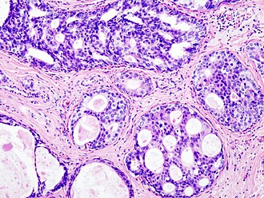

\clearpage
\pagestyle{plain}
\setcounter{page}{1}

```{r setup, include=FALSE} 
knitr::opts_chunk$set(warning = FALSE, message = FALSE, tidy = FALSE) 

```

# Introducción

La presente memoria recoge el desarrollo y resolución de la **Prueba de Evaluación Continua 1 (PEC1)** de la asignatura *Software para el Análisis de Datos*, perteneciente al **Máster Interuniversitario en Bioinformática y Bioestadística** de la **Universitat Oberta de Catalunya** y la **Universitat de Barcelona**. El principal objetivo de esta actividad es validar los conocimientos adquiridos durante los dos primeros laboratorios del curso, los cuales han estado centrados en la introducción al lenguaje de programación **R**, el entorno de desarrollo **RStudio**, a la generación de documentos mediante **R Markdown**, así como en la aplicación de técnicas básicas de **estadística descriptiva, visualización de datos y modelización**.

La memoria se estructura en **cuatro secciones**. En primer lugar, la primera sección aborda la **importación, gestión y depuración del conjunto de datos**, incluyendo la identificación de valores perdidos y la preparación de la información para su posterior análisis. En segundo lugar, se trabajan los conceptos relacionados con las **estructuras de datos y su manipulación**.

A continuación, en la tercera sección, se aplican **técnicas de estadística descriptiva y análisis de relaciones entre variables**. Finalmente, la última sección se centra en la **visualización de los datos y en la construcción de un modelo de regresión lineal**, con el fin de explorar posibles relaciones entre las variables analizadas.

El código relativo a los resultados presentados en esta memoria se encuentra disponible para su consulta en el **repositorio de público de GitHub** \href{https://github.com/Marta-Barea/biopsy-data-analysis-r}{\textcolor{uocblue}{biopsy-data-analysis-r}} asociado al trabajo. Asimismo, la **portada** y **tabla de contenidos** incluidas en el presente documento se han elaborado atendiendo a las especificaciones establecidas en el **ejercicio 1.1 de la sección 1 de la PEC1**. Es decir, cabecera que incluya título, autor, fecha y tabla de contenidos (`toc`: *`true`*). Concretamente, de la siguiente manera: 

```yaml
---
title: "Análisis estadístico y exploratorio del conjunto de datos \\textit{Biopsy}"
author: "Dra. Marta Barea Sepúlveda"
date: "25 de marzo de 2026"
output:
  pdf_document:
    toc: true
    toc_depth: 3
    number_sections: true
    highlight: tango
    latex_engine: pdflatex
    keep_tex: false
    includes:
      in_header: preamble.tex
classoption: twoside
geometry: "top=2.5cm, bottom=2.5cm, left=2.5cm, right=2.5cm"
fontsize: 11pt
lang: es
---
```

\newpage

# Sección 1: Importación, gestión de datos y configuración

En esta sección se presenta la resolución de los **ejercicios 1.2 a 1.4** correspondientes a la **Sección 1 de la PEC1**.

## Importación del conjunto de datos y recodificación de variables

En esta primera parte se procede a la instalación y carga del paquete **`MASS`**, así como a la importación del conjunto de datos *`biopsy`*. Posteriormente, se recodificarán los nombres de las variables para ajustarlos a la nomenclatura especificada en el enunciado de la PEC1. 

### Instalación y carga del paquete **`MASS`**

El paquete **`MASS`** es un paquete estadístico de R que proporciona funciones para métodos de estadística aplicada y diversos conjuntos de datos de ejemplo. 

Su instalación puede llevarse a cabo directamente desde el repositorio oficial de **`CRAN`** de la siguiente manera: 

```{r}
# Instalar paquete MASS
install.packages("MASS", repos = "https://cloud.r-project.org")
```

Una vez realizada la instalación, es posible cargar el paquete en el entorno de trabajo y comprobar la versión del mismo:

```{r}
# Cargar paquete MASS
library(MASS)

# Verificar versión
packageVersion("MASS")

```

### Carga del conjunto de datos y recodificación de variables

Una vez instalado y cargado el paquete **`MASS`**, se procede a utilizar el conjunto de datos *`biopsy`*, incluido en dicho paquete. Este dataset contiene información de biopsias de tejido mamario y diferentes variables asociadas a características celulares empleadas para la clasificación de tumores.

Para llevar a cabo la carga del conjunto de datos y visualización de su salida, se emplean los siguientes comandos:

```{r}
# Cargar dataset
data("biopsy")

# Visualizar las primeras 10 filas
head(biopsy, 10)

```

A través de la salida obtenida se puede comprobar que el conjunto de datos está constituido por un total de **10 variables**. La primera de ellas, "**`ID`**", hace referencia al identificador asociado a cada muestra. Por su parte, la variable "**`class`**" es la target y, concretamente, etiqueta la muestra según el diagnóstico (*maligno* o *benigno*). Por su parte, las variables "**`V1`**" a "**`V9`**" representan las características celulares halladas en el tejido mamario. 

Teniendo en cuenta el estado actual de las variables, se procede a recodificar los nombres de todas para que sean exactamente los siguientes (en minúsculas): "**`id`**", "**`thickness`**", "**`size_uni`**", "**`shape_uni`**", "**`adhesion`**", "**`epi_size`**", "**`bare_nuclei`**", "**`chromatin`**", "**`normal_nuclei`**", "**`mitosis`**" y "**`class`**". Para ello, se va a emplear el paquete **`dplyr`**:

```{r}
# Cargar dplyr
library(dplyr)

# Recodificar variables
biopsy <- biopsy %>% 
      rename(id = ID,
             thickness = V1,
             size_uni = V2,
             shape_uni = V3,
             adhesion = V4,
             epi_size = V5,
             bare_nuclei = V6,
             chromatin = V7,
             normal_nuclei = V8,
             mitosis = V9)

# Comprobar recodificación
names(biopsy)
```

## Identificación y limpieza de valores perdidos

El siguiente paso dentro del análisis exploratorio del conjunto de datos *`biopsy`* consiste en identificar y tratar los valores perdidos.

En primer lugar, se procede a la detección de posibles valores perdidos presentes en el conjunto de datos. Para ello, se emplea el paquete **`visdat`**, que permite obtener una representación visual del patrón de valores perdidos, facilitando así una inspección de su distribución dentro del dataset: 

```{r, fig.cap="Visualización de valores perdidos en el conjunto de datos \\textit{biopsy}.", dev="cairo_pdf", fig.width=10, fig.height=4, out.width="\\linewidth", fig.pos="H"}
# Cargar paquetes
library(visdat)
library(ggplot2)

# Visualizar distribución de NAs
vis_miss(biopsy) +
    labs(title = "",
       x = "",
       y = "Observaciones") +
    theme_minimal() +
    theme(
      axis.text.x = element_text(
        angle = 20,
        hjust = 0.6,
        vjust = 0.5
      )
    )
```

Como se puede observar en el resultado de la **Figura 1**, el conjunto de datos presenta un total de **0,2% de valores perdidos**, los cuales se encuentran además concentrados en la variable "**`bare_nuclei`**".

En base a estos resultados y, tal y como se plantea en la primera sección de la PEC1, se procede a eliminar todas las filas que contengan valores perdidos. Para ello, la forma más rápida es emplear la función **`na.omit()`** del paquete **`stats`**, que permite eliminar las filas con valores perdidos y devolver un conjunto de datos limpio: 

```{r}
# Eliminar NAs
biopsy_clean <- na.omit(biopsy)

# Comprobar presencia de NAs en el dataset limpio
any(is.na(biopsy_clean))
```

```{r}
# Contar número de filas eliminadas
n_removed <- nrow(biopsy) - nrow(biopsy_clean)
n_removed
```

Como se puede comprobar a través de la salida, el nuevo conjunto de datos *`biopsy_clean`* no presenta valores perdidos y, concretamente, **se han eliminado un total de 16 filas**.

En el caso concreto del conjunto de datos *`biopsy`*, la eliminación de casos completos no debe suponer un problema relevante, ya que, tal y como se vio anteriormente, el porcentaje de valores perdidos en este caso es muy reducido (0,2%) y, además, se encuentran concentrados únicamente en la variable "**`bare_nuclei`**". En este sentido, al eliminar dichas observaciones se estaría perdiendo una fracción muy pequeña de la muestra, lo que no debe producir un impacto significativo en términos de representatividad y, por tanto, no debería implicar alteraciones en los resultados posteriores del análisis. Sin embargo, si se hubiera dado una proporción mayor de valores perdidos o estos se hubieran encontrado distribuidos en múltiples variables, la eliminación de casos completos si podría afectar al tamaño muestral e introducir sesgos en el análisis. En este caso, sería necesario plantear otras estrategias más adecuadas como, por ejemplo, la aplicación de metodologías de imputación de variables.


## Exportación del conjunto de datos *`biopsy_clean`*

Se procede a exportar el data frame depurado a un fichero llamado "*`biopsy_clean.csv`*" sin incluir los números de fila. Para ello, se crea, si no existe, el directorio "*`data`*" en la raíz del proyecto empleando funciones de manipulación de directorios y permisos de archivos del paquete **`base`**:

```{r}
# Crear directorio data en la raíz del proyecto (si no está creado)
if (!dir.exists("../data")) {
  dir.create("../data")
}

# Comprobar la existencia/creación del directorio data
dir.exists("../data")
```

Una vez creado el directorio "*`data`*", se lleva a cabo la exportación del conjunto de datos depurado en formato **`csv`** y teniendo en cuenta el no incluir los números de fila como una columna nueva en la exportación ni la variable "**`id`**". Para ello, se empleará el paquete **`dplyr`** para la manipulación de las datos, así como funciones del paquete **`utils`** para la escritura y lectura del archivo **`.csv`**: 

```{r}
# Cargar paquete dplyr
library(dplyr)

# Eliminar la columna "id" y exportar el dataset a CSV sin rownames
biopsy_clean %>%
  select(-id) %>%
  write.csv("../data/biopsy_clean.csv", row.names = FALSE)

# Leer el archivo exportado
biopsy_check <- read.csv("../data/biopsy_clean.csv")

# Comprobar que no existe la columna "id" ni rownames exportados
names(biopsy_check)
```

A la hora de llevar a cabo la exportación del conjunto de datos depurado a **`csv`**, la actividad planteaba reflexionar sobre la necesidad de eliminar o no la variable "**`id`**". Como puede observarse en las líneas de código anteriores, en este caso se ha optado por prescindir de ella. 

Esta decisión se basa en que dicha variable actúa únicamente como un identificador de cada observación y, por tanto, no aporta información relevante de cara a análisis posteriores. Por otro lado, desde un punto de vista ético, mantener en el conjunto de datos identificadores asociados a registros médicos puede suponer un riesgo en términos de privacidad, especialmente si estos pudieran permitir la asociación de las observaciones con pacientes concretos.

# Sección 2: Estructuras de datos y manipulación avanzada

En esta sección se presenta la resolución de los **ejercicios 2.1 a 2.4** correspondientes a la **Sección 2 de la PEC1**.

## Creación y exploración de una lista de objetos

En este apartado, empleando el conjunto de datos *`biopsy_clean`*, se procede a crear una lista que contenga un vector con los nombres de las variables, el resumen estadístico de la variable "**`thickness`**" y el número total de observaciones. Además, se debe mostrar el contenido del segundo elemento de la lista. Para ello se emplea la función **`list()`** del paquete **`base`**: 

```{r}
# Crear una lista 
biopsy_list_info <- list(
  var_names = names(biopsy_clean),
  thickness_summary = summary(biopsy_clean$thickness),
  n_observations = nrow(biopsy_clean)
)

# Mostrar el contenido del segundo elemento de la lista
biopsy_list_info[[2]]
```

## Recodificación de los niveles de la variable class

La variable "**`class`**" es un factor con los niveles *benign* y *malignant*. Se procede a recodificar las etiquetas de este factor a *benign_case* y *malignant_case* (en minúsculas). Para ello, se hace uso del paquete **`dplyr`**: 

```{r}
# Cargar dplyr
library(dplyr)

# Recodificar las etiquetas de la variable 'class'
biopsy_clean <- biopsy_clean %>%
  mutate(class = recode(class,
                        benign = "benign_case",
                        malignant = "malignant_case"))

# Comprobar recodificación
levels(biopsy_clean$class)
```

## Filtrado de observaciones según condiciones en "**`thickness`**" y "**`class`**"

Se procede a seleccionar únicamente las filas que tengan un valor de "**`thickness`**" superior a 7 y pertenezcan a la clase *malignant_case*. Para ello, se emplea el paquete **`dplyr`** y se crea un subconjunto que almacene el resultado del filtrado:

```{r}
# Cargar dplyr
library(dplyr)

# Filtrar por thickness > 7 y clase 'malignant_case'
biopsy_filtered <- biopsy_clean %>%
  filter(thickness > 7, class == "malignant_case")

# Comprobar filtrado
head(biopsy_filtered, 10)
```
## Inclusión de elementos LaTeX y recursos gráficos 

Tal y como se solicita en el enunciado de la actividad, en este apartado se procede a incorporar una fórmula escrita en **LaTeX** que represente la media aritmética así como una imagen externa relacionada con el ámbito de la biología celular.

En primer lugar, la media aritmética de una variable puede expresarse mediante la siguiente formulación matemática:

\[
\bar{x} = \frac{1}{n}\sum_{i=1}^{n} x_i
\]

donde $\bar{x}$ es la media, $x_i$ cada observación y $n$ el número total de observaciones.

En segundo lugar, se incorpora una imagen histológica relacionada con el cáncer de mama con el fin de ilustrar el tipo de tejido celular:

```{r fig.cap="Imagen histológica de células de cáncer de mama observadas al microscopio.\\\\[6pt] \\centering \\footnotesize\\textit{Fuente externa: Agencia SINC (2023). \\href{https://www.agenciasinc.es/Noticias/Identifican-como-las-celulas-tumorales-del-cancer-de-mama-se-liberan-y-forman-metastasis}{\\textcolor{uocblue}{Ver artículo}}}", echo=FALSE, out.width="0.6\\linewidth", fig.align="center", fig.pos="H"}

```

# Sección 3: Estadística descriptiva y contrastes

En esta sección se presenta la resolución de los **ejercicios 3.1 a 3.4** correspondientes a la **Sección 3 de la PEC1**.

## Estadísticos descriptivos de la variable "**`size_uni`**"

Se procede a calcular la media, la mediana y la desviación típica de la variable "**`size_uni`**" y almacenar el resultado en un vector. Para ello, se emplean las funciones **`mean()`** del paquete **`base`** y **`median()`** y **`sd()`** del paquete **`stats`**:

```{r}
# Calcular media, mediana y desviación típica de size_uni
stats_size_uni <- c(
  mean = mean(biopsy_clean$size_uni, na.rm = TRUE),
  median = median(biopsy_clean$size_uni, na.rm = TRUE),
  sd = sd(biopsy_clean$size_uni, na.rm = TRUE)
)

# Mostrar el vector con los resultados
stats_size_uni
```

Tal y como puede observarse, la **media** obtenida para la variable "**`size_uni`**" es **3.15**, mientras que la **mediana** es **1**. La diferencia entre ambos valores indica que **la distribución no parece ser simétrica**. Para que una distribución sea aproximadamente simétrica se debe cumplir que la media y la mediana sean bastante similares, algo que en este caso no ocurre.

## Creación y tipología de la variable categórica "**`high_mitosis`**"

En este apartado se va a crear una nueva variable llamada "**`high_mitosis`**", la cual va a tomar el valor "yes" si el valor de mitosis es superior a 5 y "no" en caso contrario. Para ello, se procede a emplear el paquete **`dplyr`**: 

```{r}
# Cargar dplyr
library(dplyr)

# Crear variable 'high_mitosis' 
biopsy_clean <- biopsy_clean %>%
  mutate(high_mitosis = factor(if_else(mitosis > 5, "yes", "no")))

# Comprobar creación de la variable y tipología
str(biopsy_clean$high_mitosis)
```

A la vista de los resultados, se puede comprobar que la nueva variable "**`high_mitosis`**" es una **variable categórica binaria**. Transformar una variable numérica en categórica puede ayudar a simplificar el análisis y facilitar la interpretación de los resultados. Por ejemplo, en este caso, distinguir entre niveles altos y no altos de mitosis permite ver con mayor claridad si existe alguna relación con la variable "**`class`**".

## Análisis de contingencia entre "**`class`**" y "**`high_mitosis`**"

Dentro del bloque de estadística descriptiva, se procede a generar una **tabla de contingencia** entre la variable "**`class`**" y la nueva variable "**`high_mitosis`**". Para ello, se emplea la función **`table()`** del paquete **`base`**: 

```{r}
# Crear tabla de contingencia
class_mitosis_table <- table(biopsy_clean$high_mitosis, biopsy_clean$class)

# Visualizar tabla de contingencia
class_mitosis_table
```
A la vista de los resultados, se puede comprobar que cuando "**`high_mitosis`**" toma valor de "no" la mayoría de los casos son benignos. En cambio, cuando "**`high_mitosis`**" toma valor de "yes", casi todos los casos son malignos. Esto sugiere que los valores altos de mitosis aparecen con mayor frecuencia en tumores malignos que en benignos.

## Evaluación estadística de la relación entre mitosis y malignidad

Para analizar la relación entre mitosis y malignidad se aplica el **test chi-cuadrado de independencia**, ya que ambas variables son categóricas y el tamaño de la muestra es suficientemente grande. Para ello, se emplea la función **`chisq.test()`** del paquete **`stats`**: 

```{r}
# Aplicar test de chi-cuadrado 
chisq.test(class_mitosis_table)

```

El resultado del test muestra un *p-valor* de 4,799e-13, mucho menor que 0,05. Esto indica que existe una relación estadísticamente significativa entre el número de mitosis y la malignidad del tumor, observándose que los valores altos de mitosis aparecen con mayor frecuencia en los casos malignos.

# Sección 4: Visualización avanzada y modelización lineal

En esta sección se presenta la resolución de los **ejercicios 4.1 a 4.4** correspondientes a la **Sección 4 de la PEC1**.

## Gráfico de dispersión por clase 

Se procede a generar un gráfico de dispersión utilizando el paquete **`ggplot2`**, en el que la variable "**`size_uni`**" se representa en el eje *x* y "**`shape_uni`**" en el eje *y*. En este caso, los puntos se colorean según la variable "**`class`**", con el objetivo distinguir visualmente entre los casos benignos y malignos. Esto facilita observar posibles patrones o separaciones entre ambas clases. Para ello, se emplea el paquete **`ggplot2`**:

```{r, fig.cap="Gráfico de dispersión por clase.", dev="cairo_pdf", fig.width=10, fig.height=5, out.width="\\linewidth", fig.pos="H"}
# Cargar ggplot2
library(ggplot2)

# Gráfico de dispersión
library(ggplot2)

ggplot(biopsy_clean, aes(x = size_uni, y = shape_uni, color = class)) +
  geom_jitter(width = 0.25, height = 0.25, alpha = 0.7, size = 2) +
  theme_minimal()
```

En este caso, como las variables analizadas son numéricas discretas que van del 0 al 10, a la hora de realizar la representanción gráfica muchos de los puntos se acumulan y dan lugar a una estructura "escalonada". Para que se aprecie mejor dónde se concentran los datos, se ha usado **`geom_jitter()`**, que separa un poco los puntos y facilita la visualización.

A la vista de los resultados obtenidos, se puede observar que los casos benignos tienden a concentrarse en valores bajos de "**`size_uni`**" y "**`shape_uni`**", mientras que los casos malignos aparecen con mayor frecuencia a valores más altos. No obstante, existe cierto solapamiento entre ambas clases. 

## Modelo de regresión lineal para predecir "**`size_uni`**" a partir de "**`thickness`**"

Se propone calcular el modelo de regresión lineal para predecir "**`size_uni`**" en función de "**`thickness`**". Para ello, se emplea la función **`lm()`** del paquete **`stats`**:

```{r}
# Ajustar modelo de regresión lineal
linear_model <- lm(size_uni ~ thickness, data = biopsy_clean)

# Obtener coeficientes
lm_intercept <- round(coef(linear_model)[1], 2)
lm_slope <- round(coef(linear_model)[2], 2)

# Obtener coeficiente de determinación
lm_r2 <- round(summary(linear_model)$r.squared, 3)

# Resumen del modelo
summary(linear_model)
```

A la vista de los resultados, se puede comprobar que existe una relación positiva entre ambas variables, ya que el coeficiente asociado a la variable explicativa "**`thickness`**" es 0,698. Esto significa que, en general, cuando aumenta "**`thickness`**", también tiende a aumentar "**`size_uni`**". Además, dicho coeficiente resulta estadísticamente significativo (p < 2e-16), lo que refuerza la evidencia de una relación lineal entre ambas variables. Por otro lado, el **coeficiente de determinación** es 0,4128, lo que indica que aproximadamente el 41% de la variabilidad de "**`size_uni`**" puede explicarse a partir de "**`thickness`**" en este modelo. Por lo tanto, el modelo explica parcialmente la variabilidad, pero no es suficiente por sí solo para una predicción precisa.

A continuación, se representa la nube de puntos con la recta de regresión superpuesta. Para ello, se emplea el paquete **`ggplot2`**: 

```{r, fig.cap="Gráfico de dispersión de las variables thickness y size\\_uni con la recta de regresión lineal estimada.", dev="cairo_pdf", fig.width=10, fig.height=5, out.width="\\linewidth", fig.pos="H"}
# Cargar librería
library(ggplot2)

# Gráfico de dispersión con recta de regresión lineal
ggplot(biopsy_clean, aes(x = thickness, y = size_uni)) +
  geom_jitter(width = 0.25, height = 0.25,
              alpha = 0.5, size = 2,
              color = "black") +
  geom_smooth(method = "lm",
              se = TRUE,
              color = "#2C7FB8",
              fill = "#A6BDD8",
              linewidth = 1) +
  geom_label(
    x = 2.75,
    y = 10,
    label = paste0(
      "size_uni = ", lm_intercept, " + ", lm_slope, "· thickness\n",
      "R² = ", lm_r2
    ),
    size = 3.5,
    fill = "white",
    alpha = 0.9,
    label.size = 0.3,
    hjust = 1
  ) +
  labs(
    title = "",
    x = "thickness",
    y = "size_uni"
  ) +
  theme_minimal(base_size = 14) +
  theme(
    plot.title = element_text(face = "bold"),
    panel.grid.minor = element_blank()
  )
```

En el gráfico de dispersión se observa una tendencia positiva entre "**`thickness`**" y "**`size_uni`**". La recta de regresión sigue la dirección general de los puntos, aunque existe cierta dispersión alrededor de ella, indicando que la relación no es perfecta. En general, el ajuste puede considerarse razonable, aunque parte de la variabilidad de "**`size_uni`**" probablemente dependa de otras variables que no se han incluido en este modelo.

## Evaluación de la normalidad de los residuos del modelo

Se procede a generar un gráfico para evaluar la normalidad de los residuos. Para ello, emplearemos la función **`residuals()`** del paquete **`stats`** y el paquete **`ggplot2`**:

```{r, fig.cap="Gráfico Q-Q de los residuos del modelo.", dev="cairo_pdf", fig.width=10, fig.height=5, out.width="\\linewidth", fig.pos="H"}
# Cargar librería
library(ggplot2)

# Obtener residuos del modelo
lm_residuals<- residuals(linear_model)

# Gráfico Q-Q

ggplot(data.frame(lm_residuals), aes(sample = lm_residuals)) +
  stat_qq(color = "black", size = 1) +
  stat_qq_line(color = "red", linewidth = 0.5) +
  theme_minimal(base_size = 13) +
  labs(
    title = "",
    x = "Cuantiles teóricos",
    y = "Cuantiles de los residuos"
  )
```

A la vista de los resultados del gráfico Q-Q se puede observar que los residuos se alinean razonablemente con la recta de referencia en la zona central, mientras que en los extremos se aprecian desviaciones, sugiriendo posibles discrepancias respecto a la normalidad.

Para contrastar la normalidad el test más habitual es el de **Shapiro-Wilk**. Para ello, se emplea la función **`shapiro.test()`** del paquete **`stats`**: 

```{r}
# Test de normalidad Shapiro-Wilk
shapiro.test(lm_residuals)
```

El test de Shapiro-Wilk da como resultado un *p-valor* muy pequeño (p < 2,2e-16), por lo que se rechaza la hipótesis de normalidad. 

Considerando conjuntamente el resultado del test y el gráfico, puede concluirse que los residuos no siguen una distribución normal.

## Distribución de mitosis y comparación de "**`thickness`**" según la clase

En este último apartado, se lleva a cabo la visualización en una misma ventana de un histograma de la variable "**`mitosis`**" y un boxplot de "**`thickness`**" según la "**`class`**". Para ello, se emplea el paquete **`ggplot2`** y el paquete **`gridExtra`**:

```{r, fig.cap="Histograma de la variable mitosis y boxplot de la variable thickness según class.", dev="cairo_pdf", fig.width=10, fig.height=5, out.width="\\linewidth", fig.pos="H"}
# Cargar librerías
library(ggplot2)
library(gridExtra)

# Histograma de mitosis
g1 <- ggplot(biopsy_clean, aes(x = mitosis)) +
  geom_histogram(binwidth = 1, fill = "#41B6C4", color = "white") +
  labs(
    title = "Distribución de mitosis",
    x = "Número de mitosis",
    y = "Frecuencia"
  ) +
  theme_minimal()

# Boxplot de thickness según class
g2 <- ggplot(biopsy_clean, aes(x = class, y = thickness, fill = class)) +
  geom_boxplot(alpha = 0.8) +
  scale_fill_manual(values = c(
    "benign_case" = "#7FCDBB",
    "malignant_case" = "#F03B20"
  )) +
  labs(
    title = "Thickness según la clase",
    x = "Clase",
    y = "Thickness"
  ) +
  theme_minimal() +
  theme(legend.position = "none")

# Mostrar ambos gráficos en una sola ventana
grid.arrange(g1, g2, ncol = 2)
```

En base a los resultados, tal y como se puede observar, el **histograma de mitosis** muestra que la mayoría de los casos tienen valores bajos, sobre todo entre 1 y 2. Los valores altos aparecen muy pocas veces, por lo que la distribución está sesgada hacia la derecha. Por su parte, en el **boxplot** de "**`thickness`**" según "**`class`**", se observa que los tumores *malignos* suelen tener valores de "**`thickness`**" más altos que los *benignos*. Aunque hay algo de solapamiento entre ambas clases, la diferencia entre las medianas sugiere que esta variable podría estar relacionada con la malignidad.